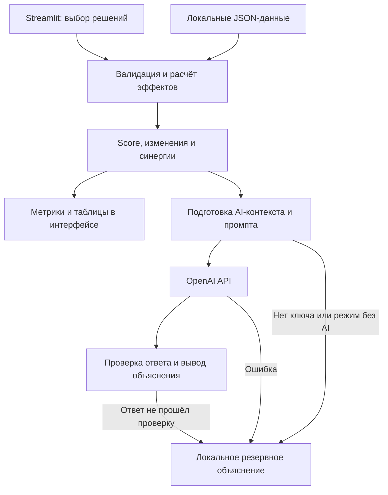

# Аким на 5 часов

**AI-симулятор управления городским бюджетом** для спецтрека Astana Innovations на HackAlem AI.

Пять районов, 14 инициатив, бюджет 100 условных единиц и ровно пять решений. Пользователь распределяет средства, видит изменения городских показателей и получает **Astana Quality of Life Score** с объяснением выбранного сценария.

**Числа рассчитывает Python-движок. AI интерпретирует готовый результат.**

## О проекте

Ограниченный городской бюджет требует выбирать между транспортом, экологией, социальной инфраструктурой, безопасностью и городскими сервисами. Улучшение среднего показателя при этом может скрывать отставание отдельного района.

Симулятор предназначен для учебного разбора таких решений: городским управленцем, аналитиком или участником деловой игры. Он позволяет проверить последствия выбранного набора инициатив в одной формальной модели и увидеть, какие районы и показатели изменились.

В проекте используется синтетический датасет с названиями районов Астаны. Результат симуляции не является прогнозом реального развития города.

## Что реализовано

- **Выбор пяти инициатив** из каталога: для районной меры выбирается район, городская действует на весь город.
- **Контроль правил:** стоимость и остаток бюджета, повторы, направления, корректность районов и несовместимость мер. Невалидный набор не получает Score; интерфейс показывает причину.
- **Расчёт эффектов:** лаги реализации, три синергии, ограничение показателей диапазоном 0–100. Исходные данные сохраняются неизменными.
- **Панель результата:** итоговый Score и изменение относительно базы, средний балл города, слабейший район, число критических значений.
- **Таблицы:** баллы всех районов, показатели выбранного района до и после, сработавшие синергии.
- **AI-объяснение на русском:** улучшения, оставшиеся проблемы и компромиссы. В интерфейсе доступны `gpt-4o-mini`, `gpt-4.1-mini`, `gpt-4.1` и модель из настройки окружения.
- **Резервное объяснение:** при отсутствии ключа, ошибке API или непрошедшем проверку ответе. Есть отдельный демонстрационный режим «Показать работу без AI».
- **Автотесты** движка, AI-интеграции и интерфейса через Streamlit AppTest.

При изменении выбранных решений прежний расчёт и объяснение сбрасываются: пользователь рассчитывает новый сценарий явно.

## Как работает решение

1. Приложение загружает районы, каталог мер и правила из `data/*.json`.
2. Пользователь выбирает пять инициатив и районы для районных мер. Счётчик показывает стоимость и остаток бюджета.
3. По кнопке **«Рассчитать сценарий»** валидатор проверяет набор. При нарушении правила расчёт останавливается.
4. Движок применяет эффекты с учётом лагов, добавляет синергии, ограничивает значения и рассчитывает районные баллы и итоговый Score.
5. Интерфейс показывает результат и таблицы изменений.
6. По кнопке **«Получить AI-объяснение»** подготовленный контекст отправляется в OpenAI. Приложение проверяет формат ответа и добавляет числовые факты из расчёта. При ошибке отображается подписанный резервный текст.

### Правила выбора

| Правило | Условие |
|---|---|
| Бюджет | Стоимость не более 100 у.е.; ровно 100 допустимо |
| Количество | Ровно 5 решений |
| Повторы | Каждый ID можно выбрать только один раз |
| Направления | Не более 2 мер одного направления |
| Районная мера | Обязателен один существующий район |
| Городская мера | Район не указывается; эффект действует во всех пяти районах |
| M1 и M3 | Несовместимы при любом размещении |
| M4 и M7; M5 и M13 | Несовместимы только при выборе одного и того же района |

Все пять направлений доступны в каталоге, но выбирать по одной мере каждого направления не требуется. Остаток бюджета не добавляет бонус к Score. Порядок решений не влияет на результат.

### Формула и синергии

Горизонт модели — **8 кварталов**. Лаг задаёт задержку начала действия меры:

```text
реализованный эффект = полный эффект × (8 − лаг) / 8
новый показатель = clip(исходное значение + сумма эффектов + синергии, 0, 100)

D_d    = сумма показателей района с весами
D_avg  = сумма районных баллов с весами по доле населения
N_crit = число пар «район × показатель» со значением строго ниже 40

Score = 0.7 × D_avg + 0.3 × min(D_d) − N_crit
```

Участие слабейшего района в формуле не позволяет оценивать сценарий только по среднему. Каждое критическое значение уменьшает результат на один балл; значение ровно 40 критическим не считается.

| Выбранная пара | Дополнительный эффект |
|---|---|
| M1 + M2 | T1 +2 в районе M1 |
| M10 + M12 | B1 +2 в районе M10 |
| M5 + M6 | E2 +2 в районе M5 |

Бонусы фиксированы и не уменьшаются лагом. Ограничение 0–100 применяется после суммирования эффектов и бонусов. В таблице изменений синергия уже включена в итоговую дельту.

## Технологии

| Компонент | Использование в проекте |
|---|---|
| **Python 3.10+** | Валидация, расчёты, подготовка контекста, обработка ответа |
| **Streamlit** | Веб-интерфейс, формы выбора, метрики, таблицы, состояние сессии |
| **OpenAI Python SDK** | Вызов OpenAI Chat Completions API |
| **`gpt-4o-mini`** | Модель по умолчанию в коде |
| **`gpt-4.1-mini`, `gpt-4.1`** | Дополнительные варианты выбора в интерфейсе |
| **JSON / JSON Schema** | Локальные исходные данные и структура ответа модели |
| **pytest, unittest.mock, Streamlit AppTest** | Автоматические проверки, в том числе с подменой ответов API |
| **Git / GitHub** | Хранение исходного кода в репозитории команды |

Проверенные версии основных зависимостей: Streamlit **1.64.0**, OpenAI SDK **3.19.0**, pytest **9.1.1**; среда проверки — Python **3.14.7**. Они зафиксированы в [requirements-tested.txt](requirements-tested.txt). Общие нижние границы версий находятся в [requirements.txt](requirements.txt).

Выбор модели не подтверждает наличие доступа к ней у конкретного API-ключа. В проекте нет отдельного REST-сервера или базы данных: интерфейс и расчётные модули работают в Python-процессе Streamlit.

## Архитектура



Основные файлы:

```text
data/
  districts.json          районы, показатели и доли населения
  initiatives.json        14 мер: типы, цены, лаги и эффекты
  rules.json              бюджет, веса, синергии и контрольные значения
engine/
  scoring.py              validate_decisions → apply_effects → compute_score; run
  changes.py              изменения показателей, синергии и вклады мер
  test_*.py               проверки правил, эффектов и Score
frontend/
  app.py                  точка входа Streamlit и сборка сценария
  selection.py            выбор мер, районов и отображение бюджета
  result.py               Score, среднее, слабейший район и баллы районов
  changes.py              таблицы изменений и синергий
  test_app.py             проверки интерфейса
ai/
  context.py              подготовка контекста из данных и результатов
  prompt.py               инструкции модели и отбор передаваемых полей
  explain.py              API-вызов, настройки и резервное объяснение
  response.py             проверка ответа и подстановка числовых фактов
  test_*.py               проверки промпта, ответа и интеграции
tools/
  check_ai.py             ручная проверка живых ответов выбранных моделей
  demo.py                 тесты, контрольный сценарий и запуск одной командой
docs/
  SPEC_CHECK.md           проверка соответствия заданию
  TOMIRIS_DEFENSE.md      речь и сценарий репетиции
  tomiris-slide.pptx      подготовленный слайд для защиты
requirements.txt          основные зависимости
requirements-tested.txt   проверенные версии основных зависимостей
```

Движок не зависит от OpenAI: сбой объяснения не меняет рассчитанный Score. Состояние текущего сценария хранится в `st.session_state`. Числовые расчёты сохраняют полную точность; округление выполняется для отображения и AI-контекста.

## Установка и запуск

### 1. Получить исходный код

Нужны Git, Python 3.10 или новее и доступ к репозиторию команды. Репозиторий приватный: для клонирования может потребоваться авторизация в GitHub.

```bash
git clone https://github.com/BAITC-Hacks/hack-fa5087f9-turtle.git
cd hack-fa5087f9-turtle
```

Все последующие команды выполняются из корня проекта.

### 2. Создать виртуальное окружение

**macOS / Linux:**

```bash
python3 -m venv .venv
source .venv/bin/activate
```

**Windows PowerShell:**

```powershell
py -3 -m venv .venv
.\.venv\Scripts\Activate.ps1
```

### 3. Установить зависимости

Для версий основных библиотек, использованных при проверке:

```bash
python -m pip install -r requirements-tested.txt
```

Также доступен `python -m pip install -r requirements.txt`, который разрешает более новые версии зависимостей. Файл `requirements-tested.txt` фиксирует основные библиотеки, но не является полным списком закреплённых транзитивных зависимостей.

### 4. Настроить AI — необязательно для расчёта

Расчёт и резервное объяснение работают без API-ключа. Для ответа модели создайте `.env` в корне проекта.

В редакторе создайте файл с именем `.env` рядом с `README.md` и добавьте:

```dotenv
OPENAI_API_KEY=ваш_ключ_OpenAI
OPENAI_MODEL=gpt-4o-mini
```

Настройки можно передать и через переменные окружения; они имеют приоритет над `.env`. Файл `.env` исключён из Git. Настоящий ключ не нужно добавлять в исходный код или README.

Для живого AI нужны интернет и ключ с доступом к выбранной модели. После изменения `.env` перезапустите приложение. Модель для следующего запроса можно переключить непосредственно в интерфейсе. Смена модели сбрасывает прежнее объяснение, но сохраняет Score и таблицы; новый ответ запрашивается кнопкой. Автоматического переключения на другую модель нет.

Предлагаемые варианты используют один OpenAI API-ключ. Их совместимость с Chat Completions и структурированным ответом описана в официальной документации: [GPT-4.1 mini](https://developers.openai.com/api/docs/models/gpt-4.1-mini), [GPT-4.1](https://developers.openai.com/api/docs/models/gpt-4.1). Качество и время ответа на нашем сценарии нужно сравнивать живыми запросами; доступность зависит от проекта ключа.

### 5. Запустить приложение

Проверить тесты и контрольный сценарий, затем открыть приложение:

```bash
python -m tools.demo
```

Для проверки настоящего AI перед запуском добавьте `--live-ai`. Это один запрос к модели из `.env`; он расходует API-токены. При ошибке появится причина и резервный ответ, а приложение всё равно запустится. Только проверка без веб-сервера: `python -m tools.demo --check-only`. Проверка конкретной модели: `python -m tools.demo --check-only --live-ai --model gpt-4.1-mini`.

Прямой запуск без предварительных тестов:

```bash
python -m streamlit run frontend/app.py
```

Откройте [http://localhost:8501](http://localhost:8501) либо адрес, указанный Streamlit в терминале. Терминал должен оставаться открытым. Остановка приложения — `Ctrl+C`.

Если браузер сообщает `ERR_CONNECTION_REFUSED`, проверьте, что процесс Streamlit запущен и в терминале нет ошибки. Если порт занят, используйте другой:

```bash
python -m streamlit run frontend/app.py --server.port 8502
```

## Как проверить решение

### Контрольный сценарий для жюри

При первом открытии интерфейса уже выбран следующий набор:

| Мера | Размещение | Стоимость, у.е. |
|---|---|---:|
| M7 — школа и детсад | Нура | 24 |
| M8 — центр семейного здоровья / поликлиника | Нура | 20 |
| M10 — освещение и камеры | Нура | 12 |
| M12 — цифровая платформа обращений | Весь город, район не выбирается | 14 |
| M5 — переход на чистое топливо | Сарыарка | 25 |
| **Всего** | | **95** |

1. Нажмите **«Рассчитать сценарий»**.
2. Сопоставьте результат с таблицей ниже.
3. Откройте изменения Нуры и таблицу сработавших синергий.
4. Нажмите **«Получить AI-объяснение»**. При настроенном и доступном API появится AI-комментарий с названием модели. Иначе будет явно подписанное резервное объяснение.

| Проверка | Ожидаемый результат |
|---|---|
| Стоимость / остаток | **95 / 5 у.е.** |
| Итоговый Score | **56.54**; до округления `56.54307` |
| Изменение Score к базе | **+3.99** |
| Средний балл города | **58.08** |
| Слабейший район | **Нура** |
| Критических значений | **0** |
| Синергия | **M10 + M12 → B1 +2 в Нуре** |
| Изменения Нуры | S1 **+10**, S2 **+8.75**, B1 **+12.5**, B2 **+1.75**, C2 **+4.375** |
| Изменения Сарыарки | E2 **+8.75**, C1 **+2.5**, C2 **+4.375** |
| Эффект M12 во всех районах | C2 **+4.375**, на экране **+4.38** |

Базовый Score — `52.55768`, на экране **52.56**. Дельта считается до округления: `56.54307 − 52.55768 = 3.98539`, поэтому отображается **+3.99**. Полная дельта B1 **+12.5** уже включает синергию **+2**.

### Дополнительные проверки в интерфейсе

- **Отказ AI (проверка устойчивости, не основной сценарий защиты):** включите «Показать работу без AI» и снова запросите объяснение. API не вызывается; Score и три таблицы остаются, текст подписан как резервный. После проверки снимите отметку.
- **Изменение решения:** замените M5 на M4 в Сарыарке. Старый результат исчезнет; после нового расчёта Score изменится.
- **Превышение бюджета:** выберите M3/Есиль, M5/Сарыарка, M8/Нура, M12/город и M10/Алматы. Стоимость составит **101**, расчёт должен быть заблокирован.
- **Несовместимость:** выберите M1/Есиль, M3/Нура, M9/Сарыарка, M10/Алматы и M12/город. Стоимость **84**, но M1/M3 несовместимы, поэтому Score не рассчитывается.

### Автоматические проверки

```bash
python -m pytest -q
```

Для версии, на которой подготовлен этот README, результат — **91 пройденный тест**. Проверяются контрольные числа, бюджет, несовместимости, лаги всех 14 мер, три синергии, городские эффекты, границы 0–100, неизменность исходных данных, все 120 перестановок контрольного набора, AI-ответы и сохранение результатов в интерфейсе при отказе API.

Служебный вызов `run([])` вычисляет базовый Score без мер. Это отдельный режим для сравнения и тестов: пустой набор не становится допустимым игровым решением.

Для проверки реальных запросов к трём моделям:

```bash
python -m tools.check_ai --models gpt-4o-mini gpt-4.1-mini gpt-4.1
```

Команда выводит ответ, длительность запроса и статус «ЖИВОЙ AI» или «РЕЗЕРВНЫЙ ОТВЕТ». Она расходует API-токены; если хотя бы одна модель возвращает резервный ответ, команда завершается с кодом 1. Автотесты используют подменённые ответы и не подтверждают доступ к живому API.

## Данные и интеграции

Источники расчёта — три файла в репозитории:

| Файл | Содержимое |
|---|---|
| [data/districts.json](data/districts.json) | Есиль, Алматы, Сарыарка, Байконур, Нура; доли населения и десять показателей каждого района |
| [data/initiatives.json](data/initiatives.json) | Каталог из 14 мер с направлениями, типами, ценами, лагами и полными эффектами |
| [data/rules.json](data/rules.json) | Бюджет, горизонт, веса, порог критичности, несовместимости, синергии и контрольные сценарии |

| Направление | Показатели |
|---|---|
| Транспорт | T1 — разгрузка дорог; T2 — доступность общественного транспорта |
| Экология | E1 — озеленение; E2 — качество воздуха |
| Социальная сфера | S1 — школы и детсады; S2 — поликлиники |
| Безопасность | B1 — безопасность улиц; B2 — безопасность дорожного движения |
| Городские сервисы | C1 — надёжность ЖКХ; C2 — скорость решения обращений |

Все показатели имеют шкалу **0–100**, где больше — лучше. Их изменения измеряются в баллах модели.

**OpenAI API** используется только для текстового объяснения. В запрос передаются выбранные меры, стоимость и остаток бюджета, лаги, итоговые показатели, изменения и синергии. Вклады отдельных мер передаются после учёта лага и отдельно от итоговых дельт. Исходные эффекты каталога до лага исключаются из списка выбранных мер в промпте.

Ответ запрашивается по JSON-схеме с тремя текстовыми разделами. Приложение подставляет числовые факты из расчёта, отклоняет некорректную структуру, цифры в комментариях и некоторые явные противоречия переданным данным. Вызов API ограничен таймаутом 20 секунд, автоматические повторные попытки отключены.

Интеграций с городскими информационными системами, датчиками или внешними источниками статистики в текущей версии нет. Для локального расчёта после установки зависимостей внешние сервисы не нужны.

## Ограничения текущей версии

- **Синтетическая модель:** фиксированные цены, эффекты, веса и горизонт не описывают всю сложность реального городского управления.
- **Фиксированный каталог:** интерфейс не поддерживает загрузку собственного датасета или редактирование правил.
- **Один текущий сценарий:** нет постоянного хранения истории, таблицы результатов команд, авторизации или отдельного экрана сравнения сохранённых сценариев.
- **Нет поиска оптимального набора:** приложение оценивает выбор пользователя. Автоматический подбор мер и моделирование случайных городских событий не реализованы.
- **AI зависит от внешнего API:** возможны ошибки ключа, доступа, лимитов и сети. Резервное объяснение формируется локально и не выдаётся за ответ модели.
- **Проверка текста не гарантирует смысловую безошибочность AI.** Модель может неточно интерпретировать факты даже при корректном формате; результат требует содержательной проверки.
- **Материалы защиты подготовлены отдельно:** слайд в `docs/` не означает, что приложение умеет автоматически генерировать презентации.
- **Границы воспроизводимости:** в [отчёте проверки](docs/SPEC_CHECK.md) зафиксированы локальные автотесты и проверенные версии. Свежая установка через интернет, запуск веб-сервера из ограниченной среды проверки и успешный живой вызов новой AI-интеграции не подтверждены этим отчётом.

## Развёрнутая версия

**Публичная ссылка на развёрнутое приложение в текущем репозитории не указана.** Для проверки используйте инструкцию локального запуска выше. `localhost:8501` — адрес приложения на компьютере, где запущен Streamlit, а не публичная демоверсия.

Репозиторий команды: [BAITC-Hacks/hack-fa5087f9-turtle](https://github.com/BAITC-Hacks/hack-fa5087f9-turtle).

## Команда и материалы защиты

| Участница | Зона ответственности |
|---|---|
| Ардак | Выбор решений, валидация, бюджет, подготовка AI-контекста |
| Айсана | Эффекты, лаги, синергии, изменения районов и содержание промпта |
| Томирис | Score, сборка сценария, панель результата, AI-интеграция и резервный режим |

- [Проверка по ТЗ](docs/SPEC_CHECK.md)
- [Речь и сценарий репетиции](docs/TOMIRIS_DEFENSE.md)
- [Слайд о Score и надёжности AI](docs/tomiris-slide.pptx)
